# Simple CDash Examples

Jump to instructions for
* [Java](#java-using-maven-and-junit)

## Setup

The default setup in this repository will send all testing data to the [TestDashboard CDash page](http://trunk.cdash.org/index.php?project=TestDashboard). To make your own project CDash page, go to [my.cdash.org](http://my.cdash.org/) and click "Start my dashboard".

In the screen that follows, specify you want a new account:

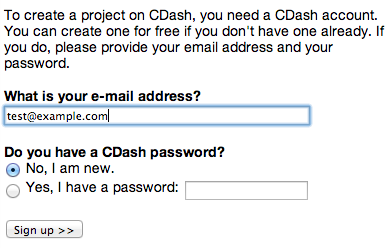

Then fill in your information:

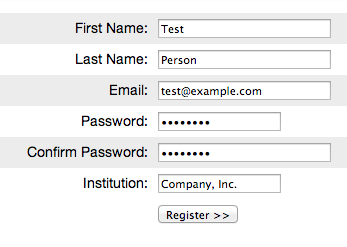

Then login to CDash:

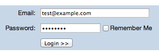

CDash will automatically start you on creating a new project. Fill in basic information:

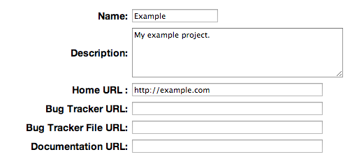

Repository information (optional):

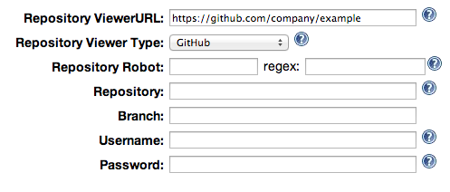

Enter code metrics information (normally keep defaults):

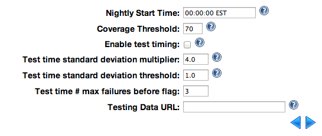

Set notification options:

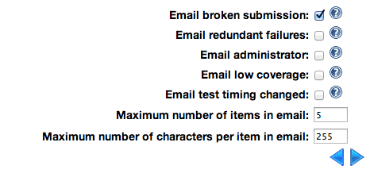

Stick with the free edition. This just applies to http://my.cdash.org sites where due to server constraints we limit free dashboards to 10 submissions a day:

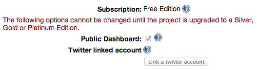

You can skip sending invites:

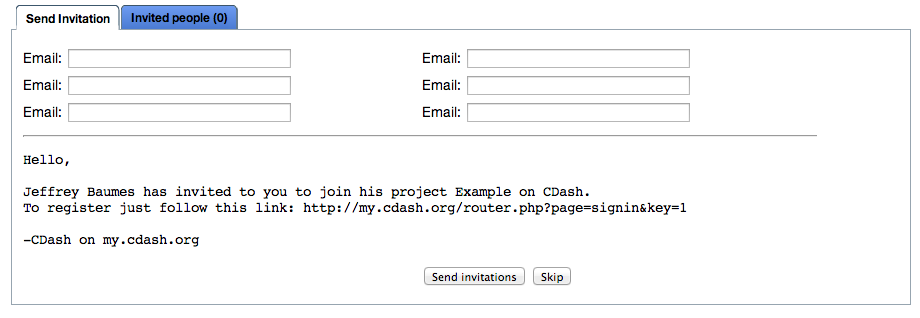

Then you can just click "Upgrade later" on http://my.cdash.org:

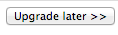

Once this is done, you will see your project on your CDash admin page:

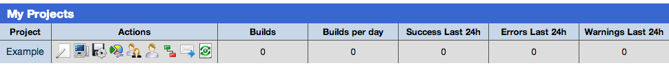

Click on the Edit project button  to see and edit your project's settings. Download the `CTestConfig.cmake` file from the Miscellaneous tab. This file tells CMake where to submit your project's tests. It can also be adapted to a CTest-only project's `DartConfiguration.ini` file.

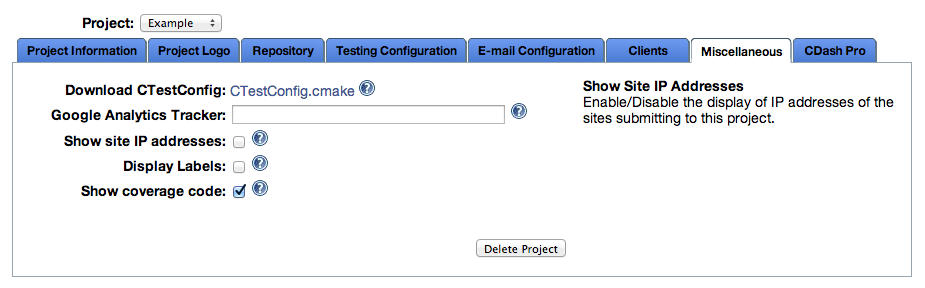

It is good practice to commit this file into your source repository so others will know how to submit tests for your project.

## [C++ using CMake](c++-cmake)

This is an example of using CDash in combination with CMake in a C++ project, which is the most automated and convenient way to use CDash.

### Prerequisites:
* C++ build environment (g++, Visual Studio, etc.)
* CMake

To build with CMake, configure CMake with the following (alternately you can use the CMake GUI to do the equivalent):

```
mkdir build
cd build
cmake ..
make
```

Now that the code is built, run the tests by running `ctest` with no arguments in your `build` directory:

```
ctest
```

This will print the results of testing to your console. Note that the `CMakeLists.txt` includes the special commands `include(CTest)` and `add_test(<test-name> <test-executable> [<arg1>, <arg2>, ...])`. The `add_test()` function may be called any number of times to add tests. The executables do not need to be related in any way with the project build. The only requirement is that a zero return value from the executable signals a passing test and a nonzero return value signals an error.

To submit the tests to a dashboard, first edit `CTestConfig.cmake` to point to the CDash host and project. You can retrieve an appropriate `CTestConfig.cmake` file from the web-based settings in your CDash project. Now re-run `make` then execute:

```
ctest -D Experimental
```

This will send the results as XML to be parsed by CDash and displayed on the project dashboard.

## [C++ using another build system](c++-other)

This example uses CDash in a C++ project that does not use CMake for its build process.

### Prerequisites:
* C++ build environment (g++, Visual Studio, etc.)
* CMake (for the `ctest` executable)

In this case, we will not use `cmake` command at all, but will only rely on the `ctest` executable. This means we need to do a few extra things ourselves. The `cmake` command produces a `CTestTestfile.cmake` script to specify tests to run and a `DartConfiguration.tcl` configuration file as a result of the configuration process. You can inspect these files that are produced in the `c++-cmake` example. In the case of using only `ctest`, we simply need to produce these files manually. But don't worry, it's relatively easy.

The `DartConfiguration.tcl` mirrors the information in `CTestConfig.cmake`, and it is straightforward to create one based on the `CTestConfig.cmake` downloaded from CDash.

The `CTestTestfile.cmake` simply contains the `add_test()` calls to specify each test. Just as in a CMake script, the calling structure is `add_test(<test-name> <test-executable> [<arg1>, <arg2>, ...])`.

Once these files are created, simply run `make` to build the project, then enter `ctest` with no arguments to run your tests and output results to the terminal. To send to CDash, execute:

```
ctest -D Experimental
```

## [Java using Maven and JUnit](java)

This directory contains a Maven project that is tested with JUnit. To run the Maven build and tests, execute

    mvn test

To upload JUnit result to CDash first clone the CDash Maven plugin.
    
    git clone https://github.com/cjh1/maven-cdash-plugin.git

Install the plugin into your local repository.

    mvn install

Then in your Maven project use the following command to upload test results.

    mvn com.kitware.maven.plugins:maven-cdash-plugin:upload-report-surefire

## [Javascript using Jasmine](javascript)

### Prerequisites:
* [Node.js](http://nodejs.org/)
* RequireJS for node (`npm install -g requirejs`)
* Jasmine for node (`npm install -g jasmine-node`)
* CMake (for `ctest` executable)

## [Python using unittest](python)

### Prerequisites:
* Python
* CMake (for `ctest` executable)
